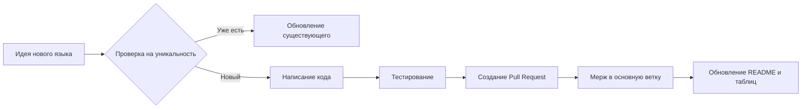

# 🌍 Hello World Universe

[](https://opensource.org/licenses/MIT)
[](http://makeapullrequest.com)

---

## 📑 Навигация по документу (Якорные ссылки)

*   [🚀 Описание проекта](#-описание-проекта)
*   [🔍 Навигация по проекту](#-Навигация-по-проекту)
*   [💻 Примеры кода](#-примеры-кода)
*   [📊 Сравнение с аналогами](#-сравнение-с-аналогами)
*   [🔧 Процесс работы](#-процесс-работы)
*   [🤝 Как поддержать проект](#-как-поддержать-проект)

---

## 🚀 Описание проекта

Проект **"Hello, World!" Universe** — это *инновационный* проект, который выводит классическое **"Hello, World!"** на новый уровень. Он поддерживает более `50` языков программирования и `30` человеческих языков, делая первое знакомство с кодингом поистине международным!. 

> «Программирование — это как искусство. Это не просто работа, это способ выражения» — Дональд Кнут

---

## 🔍 Навигация по проекту
1. [💻 Документация по исходному коду](src/README.md)
2. [🌐 Руководство по переводам](translations/README.md)
3. [🖼️ Описание ресурсов проекта](resources/README.md)

---

## 💻 Примеры кода

Вот как выглядит начало в некоторых популярных языках:

**Начало C++:**
```C++
#include <iostream>  
using namespace std;  
int main() {  
    cout << "Hello World!" << endl;  
    return 0;  
}  
```

**Начало C#:**
```C#
#include <stdio.h>  
int main() {  
    printf("Hello, World!\n");  
    return 0;  
}  
```

---

## 📊 Сравнение с аналогами

Проект не уникален, но мы стараемся быть лучше! Вот небольшая сравнительная таблица:

| Характеристика | **Hello, World! Collection** | **GitHub Search** | **HelloWorld Example** |
| :--- | :--- | :--- | :--- |
| **Структура** | Логичная, по папкам | Разрозненные репозитории | Один файл |
| **Документация** | **Полная, на Markdown** | Часто отсутствует | Минимальная |
| **Цель** | Обучение и коллекционирование | Решение конкретной задачи | Демонстрация |
| **Вклад (PR)** | **Приветствуется!** | Зависит от автора | Редко |
| **"Изюминка"** | Переводы + код | Количество | Простота |

---

## 🔧 Процесс работы

Весь жизненный цикл добавления нового языка выглядит так:



## 🖼️ Скриншоты и ресурсы

**Логотип проекта:**


