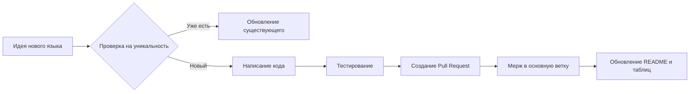

# 🌍 Hello World Universe

[](https://opensource.org/licenses/MIT)

### 🔍 Навигация по проекту
1. [💻 Документация по исходному коду](src/README.md)
2. [🌐 Руководство по переводам](translations/README.md)
3. [🖼️ Описание ресурсов проекта](resources/README.md)

---

## 📑 Навигация по документу (Якорные ссылки)

*   [🚀 Описание проекта](#-описание-проекта)
*   [📚 Документация проекта](#-документация-проекта)
*   [💻 Примеры кода](#-примеры-кода)
*   [📊 Сравнение с аналогами](#-сравнение-с-аналогами)
*   [🔧 Процесс работы](#-процесс-работы)
*   [🤝 Как поддержать проект](#-как-поддержать-проект)

---

## 🚀 Описание проекта

Проект **"Hello, World!" Collection** — это больше, чем просто первая программа. Это **культурный артефакт** мира разработки, *своего рода "ритуал посвящения"* для каждого нового языка или технологии. 

**Цель проекта:** создать централизованный, хорошо структурированный репозиторий, который наглядно показывает, как начинается путь программиста в разных экосистемах — от классического **C** до современных **Go** и **Rust**.

> "Программирование — это не наука, а ремесло, и 'Hello, World!' — это первое касание резцом к камню." — *Анонимный разработчик*

---

## 📚 Документация проекта

Все документы проекта доступны по следующим ссылкам:

1.  **[Исходный код (`/src`)](./src/README.md)** — Здесь живут все программы.
2.  **[Переводы (`/translations`)](./translations/README.md)** — Как звучит "Привет, мир!" на разных человеческих языках.
3.  **[Ресурсы (`/resources`)](./translations/resources/README.md)** — Иконки, логотипы и прочие медиафайлы.

---

## 💻 Примеры кода

Вот как выглядит начало в некоторых популярных языках:

**Классика на Python:**
```python
def main():
    # Это простой и элегантный вывод
    print("Hello, World!")

if __name__ == "__main__":
    main()
```

**Строгий и быстрый Go:**
```go
package main

import "fmt"

func main() {
    fmt.Println("Hello, World!") // Четко и по делу
}
```

---

## 📊 Сравнение с аналогами

Проект не уникален, но мы стараемся быть лучше! Вот небольшая сравнительная таблица:

| Характеристика | **Hello, World! Collection** | **GitHub Search** | **HelloWorld Example** |
| :--- | :--- | :--- | :--- |
| **Структура** | Логичная, по папкам | Разрозненные репозитории | Один файл |
| **Документация** | **Полная, на Markdown** | Часто отсутствует | Минимальная |
| **Цель** | Обучение и коллекционирование | Решение конкретной задачи | Демонстрация |
| **Вклад (PR)** | **Приветствуется!** | Зависит от автора | Редко |
| **"Изюминка"** | Переводы + код | Количество | Простота |

---

## 🔧 Процесс работы

Весь жизненный цикл добавления нового языка выглядит так:



## 🖼️ Скриншоты и ресурсы

**Логотип проекта (условный):**


*Пример иконки (использована для демонстрации)*

**Визуализация структуры:**


*Схема организации файлов*
